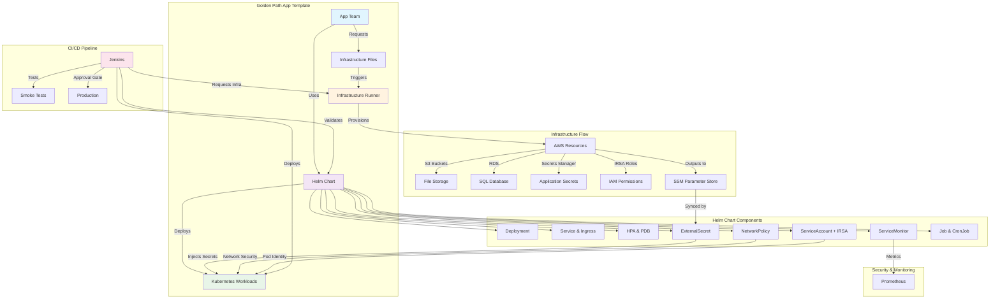

# Golden Path Architecture

## Overview

The Golden Path App Template implements a platform-as-a-service approach that separates concerns between platform teams and application teams, providing self-service infrastructure provisioning with built-in security and best practices.

## Architecture Diagram

## Component Responsibilities

### Application Team
- **Uses** the golden path template as a starting point
- **Customizes** application-specific configurations
- **Requests** infrastructure through YAML files
- **Deploys** applications via CI/CD pipelines

### Platform Team
- **Maintains** the golden path template
- **Provides** the infrastructure runner and Terraform modules
- **Manages** EKS clusters and platform add-ons
- **Ensures** security and compliance guardrails

### Infrastructure Runner
- **Validates** infrastructure requests against schemas
- **Provisions** AWS resources using Terraform modules
- **Stores** resource outputs in SSM Parameter Store
- **Manages** lifecycle of infrastructure resources

### Kubernetes Platform
- **Hosts** applications in secure, multi-tenant namespaces
- **Provides** ingress, monitoring, and secrets management
- **Enforces** network policies and resource quotas
- **Scales** applications based on demand

## Data Flow

1. **Application Request**: App teams create infrastructure request files (`infra/requests/{env}.yaml`)
2. **CI/CD Trigger**: Jenkins pipeline processes the request
3. **Infrastructure Provisioning**: Runner validates and provisions AWS resources
4. **Secret Storage**: Resource outputs stored securely in AWS SSM
5. **Application Deployment**: Helm chart deploys with environment-specific values
6. **Secret Injection**: External Secrets syncs AWS SSM values into Kubernetes secrets
7. **Runtime**: Application pods access secrets and AWS resources via IRSA

## Security Architecture

### Identity and Access
- **IRSA (IAM Roles for Service Accounts)**: Pod-level AWS permissions
- **Service Accounts**: Kubernetes identity mapped to AWS roles
- **Least Privilege**: Minimal required permissions per application

### Network Security
- **NetworkPolicies**: Zero-trust pod-to-pod communication
- **Ingress Security**: SSL termination, rate limiting, WAF protection
- **VPC Isolation**: Multi-environment network separation

### Secret Management
- **AWS SSM Parameter Store**: Centralized secret storage
- **External Secrets Operator**: Automatic secret synchronization
- **No Secrets in Git**: All sensitive data managed externally

### Container Security
- **Non-root Execution**: All containers run as unprivileged users
- **Read-only Filesystem**: Immutable container filesystems
- **Security Contexts**: Dropped capabilities and privilege escalation prevention

## Monitoring and Observability

### Metrics Collection
- **ServiceMonitor**: Automatic Prometheus scraping configuration
- **Custom Metrics**: Application-specific metrics endpoints
- **Platform Metrics**: Resource utilization and performance

### Health Monitoring
- **Readiness Probes**: Traffic routing decisions
- **Liveness Probes**: Container restart decisions
- **Startup Probes**: Graceful application initialization

### Logging
- **Structured Logging**: JSON formatted logs with correlation IDs
- **Centralized Collection**: Platform-managed log aggregation
- **Audit Trails**: Security and compliance logging

## Scalability and Reliability

### Horizontal Scaling
- **HPA (Horizontal Pod Autoscaler)**: CPU-based automatic scaling
- **Custom Metrics**: Application-specific scaling triggers
- **Resource Quotas**: Prevent resource exhaustion

### Availability
- **Pod Disruption Budgets**: Maintain minimum available replicas
- **Multi-AZ Deployment**: Cross-availability zone distribution
- **Rolling Updates**: Zero-downtime deployments

### Disaster Recovery
- **Backup Strategies**: Automated data backup for stateful resources
- **Cross-Region Replication**: Critical data replication (production)
- **Recovery Procedures**: Documented recovery processes

## Environment Progression

### Development
- **Purpose**: Fast iteration and testing
- **Configuration**: Lower resources, debug logging
- **Security**: Relaxed policies for development speed
- **Data**: Synthetic or anonymized data

### Staging
- **Purpose**: Production-like testing environment
- **Configuration**: Production-equivalent setup
- **Security**: Production-level security controls
- **Data**: Production-like data volumes

### Production
- **Purpose**: Live customer-facing workloads
- **Configuration**: High availability, performance optimized
- **Security**: Strict security controls and monitoring
- **Data**: Live customer data with full compliance

## Integration Points

### With Infrastructure Platform DevOps
- **Terraform Modules**: Reusable infrastructure components
- **Runner Jobs**: Infrastructure provisioning automation
- **Add-on Management**: Platform service management

### With CI/CD Systems
- **Jenkins Integration**: Pipeline automation and approvals
- **GitOps Workflows**: Configuration management
- **Artifact Management**: Container image and Helm chart storage

### With AWS Services
- **IAM Integration**: Role-based access control
- **SSM Parameter Store**: Secret and configuration management
- **CloudWatch**: Monitoring and alerting integration

## Golden Path Philosophy

This platform implements a **Golden Path** approach:

- **Simple over Complex**: Only 4 resource types that cover 80% of application needs
- **Secure by Default**: Best practices built into every resource
- **Environment Progression**: Automatic scaling from dev → stage → prod
- **Developer-Friendly**: Focus on business needs, not infrastructure complexity

### Resource Types

1. **S3 Buckets** - File storage and static websites
2. **RDS Databases** - Postgres/MySQL (optional, only if needed)
3. **Secrets Manager** - API keys and credentials
4. **IRSA Roles** - Secure AWS access for Kubernetes pods

### Benefits

- **Fast Onboarding**: New teams productive in hours, not weeks
- **Reduced Complexity**: No need to learn 20+ AWS services
- **Consistent Security**: Same security model across all applications
- **Cost Optimization**: Right-sized resources for each environment

This architecture provides a **starting point** for 80% of applications while maintaining the flexibility to add complexity when truly needed.
